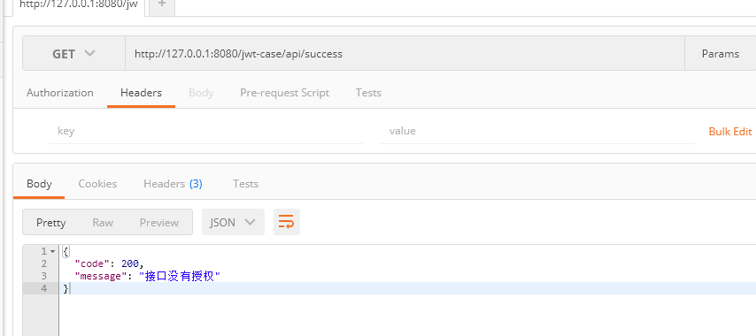

#### 使用jwt授权接口，做统一授权拦截


1、引入pom

```xml
<dependency>
    <groupId>io.jsonwebtoken</groupId>
    <artifactId>jjwt</artifactId>
    <version>${jjwt.vedrsion}</version>
</dependency>
```

2、定义filter

- 使用@WebFilter定义filter
- 使用@bean注册filter

```java
@Component
public class FilterRegistration{

    @Bean
    public FilterRegistrationBean jwtFilter() {
        FilterRegistrationBean registrationBean = new FilterRegistrationBean(
            new JwtFilter());
        registrationBean.addServletNames("jwtFilter");
        registrationBean.addUrlPatterns("/api/success");
        return registrationBean;
    }
}
 ```
Filter可以参考`JwtFilter`类。

3、验证

访问http://127.0.0.1:8080/jwt-case/api/auth?username=guoxiaohei&issure=case, 进行授权

1. 用postman进行访问  




2. 使用curl 验证

```declarative
curl -H "Content-Type: application/json" \
     -H "Authorization: auth{token}" \
     http://localhost:8080/jwt-case/api/success

# windows 

curl -H "Content-Type: application/json" ^
-H "Authorization: auth{token}" ^
http://localhost:8080/jwt-case/api/success
```


**ps:Jdk 17 环境,spring-boot3.x构建**